# Diagrams

This document contains all Mermaid diagrams for the AZ-104 Simulator. These visualizations help understand the architecture, data model, and user flows.

## Table of Contents

1. [Component Diagram](#component-diagram)
2. [ER Diagram (Database Schema)](#er-diagram)
3. [Sequence Diagrams](#sequence-diagrams)
   - [Practice Mode](#practice-mode-sequence)
   - [Exam Mode](#exam-mode-sequence)
   - [Attempt History](#attempt-history-sequence)
   - [Language Switch](#language-switch-sequence)
4. [State Machine](#attempt-state-machine)

---

## Component Diagram

High-level architecture showing how major components interact.


---

## ER Diagram

Database schema showing all tables, relationships, and key constraints.


**Key Constraints**:

- `UNIQUE (session_id, question_id)` on `EXAM_SESSION_QUESTION` → **No duplicate questions per session**
- `UNIQUE (session_id, position)` on `EXAM_SESSION_QUESTION` → **No position conflicts**
- `UNIQUE (attempt_id, question_id)` on `ATTEMPT_ANSWER` → **No duplicate questions per attempt**
- `UNIQUE (attempt_id, position)` on `ATTEMPT_ANSWER` → **Stable question ordering**

---

## Sequence Diagrams

### Practice Mode Sequence

User flow for practice mode with immediate feedback.

```mermaid
sequenceDiagram
    actor User
    participant Browser
    participant HomeController
    participant ExamController
    participant AttemptService
    participant ExamSessionService
    participant QuestionService
    participant Database
    
    User->>Browser: Click "Start Practice"
    Browser->>HomeController: GET /config?mode=PRACTICE
    HomeController-->>Browser: Show config page
    
    User->>Browser: Configure (20 questions, Compute)
    Browser->>ExamController: POST /attempt/start
    
    ExamController->>ExamSessionService: startSession(PRACTICE, 20, "en", [COMPUTE])
    ExamSessionService->>Database: Create EXAM_SESSION
    ExamSessionService->>Database: Select 20 random questions
    ExamSessionService->>Database: Insert EXAM_SESSION_QUESTION (with unique constraints)
    ExamSessionService-->>ExamController: sessionId
    
    ExamController->>AttemptService: createAttempt(PRACTICE, 20, sessionId)
    AttemptService->>Database: Create ATTEMPT
    AttemptService->>Database: Create ATTEMPT_ANSWER for each question
    AttemptService-->>ExamController: attemptId
    
    ExamController-->>Browser: Redirect to /attempt/{attemptId}/question/0
    
    loop For each question
        Browser->>ExamController: GET /attempt/{attemptId}/question/{index}
        ExamController->>AttemptService: getQuestionForAttempt(attemptId, index, PRACTICE)
        AttemptService->>QuestionService: toDto(questionId, includeCorrectAnswers=false)
        QuestionService->>Database: SELECT question, options
        QuestionService-->>AttemptService: QuestionDto (localized)
        AttemptService-->>ExamController: QuestionDto with user's previous answer
        ExamController-->>Browser: Render exam.html
        
        User->>Browser: Select answer, click "Next"
        Browser->>ExamController: POST /attempt/{attemptId}/answer
        ExamController->>AttemptService: saveAnswer(attemptId, questionId, selectedOptions)
        AttemptService->>Database: UPDATE ATTEMPT_ANSWER
        AttemptService-->>ExamController: Success
        
        alt Practice Mode (immediate feedback)
            ExamController->>QuestionService: toDto(questionId, includeCorrectAnswers=true)
            QuestionService-->>ExamController: QuestionDto with correct answers
            ExamController-->>Browser: Show feedback (✓ or ✗) + explanation
        end
    end
    
    User->>Browser: Click "Review All"
    Browser->>ExamController: GET /attempt/{attemptId}/review
    ExamController->>AttemptService: getAttemptStatus(attemptId)
    AttemptService->>Database: Count answered/unanswered/marked
    AttemptService-->>ExamController: Status summary
    ExamController-->>Browser: Render review.html
    
    User->>Browser: Click "Submit"
    Browser->>ExamController: POST /attempt/{attemptId}/submit
    ExamController->>AttemptService: completeAttempt(attemptId)
    AttemptService->>AttemptService: calculateResults()
    AttemptService->>Database: UPDATE ATTEMPT (is_completed=true, score_percentage)
    AttemptService-->>ExamController: Success
    
    ExamController-->>Browser: Redirect to /attempt/{attemptId}/results
    Browser->>ExamController: GET /attempt/{attemptId}/results
    ExamController->>AttemptService: getResults(attemptId)
    AttemptService-->>ExamController: ResultDto (score, domain breakdown)
    ExamController-->>Browser: Render results.html
```



---

### Exam Mode Sequence

User flow for exam mode with timer and no immediate feedback.


---

### Attempt History Sequence

User reviewing past attempts.


---

### Language Switch Sequence

User changing interface language.

```mermaid
sequenceDiagram
    actor User
    participant Browser
    participant LocaleController
    participant LocaleInterceptor
    participant QuestionService
    participant MessageSource
    
    User->>Browser: Select "🇬🇧 English" from dropdown
    Browser->>LocaleController: GET /locale/change?lang=en&redirect=/config
    
    LocaleController->>LocaleController: Parse locale "en"
    LocaleController->>LocaleController: Set cookie lang=en (max-age 1 year)
    LocaleController->>LocaleController: LocaleContextHolder.setLocale(Locale.EN)
    LocaleController-->>Browser: Set-Cookie header with lang=en
    LocaleController-->>Browser: Redirect to /config
    
    Browser->>Browser: Store cookie
    Browser->>LocaleController: GET /config
    Note over Browser: Cookie sent with request
    
    LocaleInterceptor->>LocaleInterceptor: preHandle(request)
    LocaleInterceptor->>LocaleInterceptor: Read cookie lang value
    LocaleInterceptor->>LocaleInterceptor: Set locale to EN
    
    LocaleController->>MessageSource: getMessage for config.title in EN
    MessageSource->>MessageSource: Load messages_en.properties
    MessageSource-->>LocaleController: Return "Configure Your"
    
    alt Rendering question content
        LocaleController->>QuestionService: toDto with lang EN
        QuestionService->>QuestionService: Select stem_en, explanation_en, text_en
        QuestionService-->>LocaleController: QuestionDto (English content)
    end
    
    LocaleController-->>Browser: Render page in English
    
    Note over Browser: All UI labels from messages_en.properties<br/>All question content from EN columns
```



---

## Attempt State Machine

Lifecycle of an `Attempt` entity.


**State Details**:

| State | Properties | Allowed Actions |
|-------|-----------|----------------|
| **Created** | `is_completed=false`, `ended_at=null` | Start answering, abandon |
| **InProgress** | `is_completed=false`, answers accumulating | Answer, navigate, mark, submit |
| **Completed** | `is_completed=true`, `ended_at` set, score calculated | Review only (read-only) |

**State Transitions**:

- **Created → InProgress**: Automatic on first answer
- **InProgress → InProgress**: Each answer/navigation
- **InProgress → Completed**: User submits or timer expires (Exam mode)
- **Completed → [no transition]**: Terminal state

---

## Usage Notes

### Viewing Mermaid Diagrams

These diagrams render automatically on:
- **GitHub**: In Markdown preview
- **GitLab**: In Markdown preview
- **VS Code**: With Mermaid extension
- **IntelliJ**: With Mermaid plugin

Or use online viewer: https://mermaid.live/

### Exporting Diagrams

**To PNG/SVG**:
1. Copy diagram code
2. Paste into https://mermaid.live/
3. Click "Export" → PNG or SVG

**To PDF** (for documentation):
1. Use Mermaid CLI:
   ```bash
   npm install -g @mermaid-js/mermaid-cli
   mmdc -i diagrams.md -o diagrams.pdf
   ```

---

**Tip**: These diagrams are living documentation. If the architecture changes, update the diagrams first, then the code. Visual consistency helps onboarding. 📊

